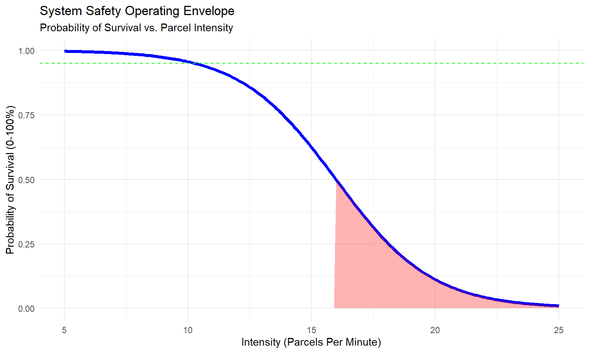
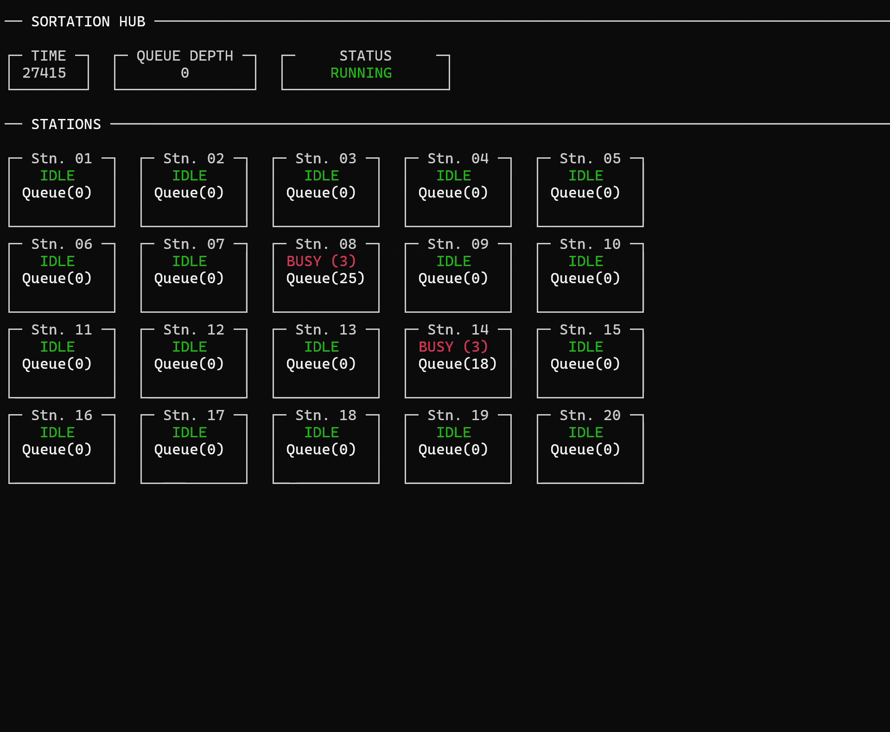

# 📦 Sortation Hub: Forensic Simulation & Failure Analysis


> **The Mission:** Build a stochastic simulation of a logistics hub, identify the mathematical root cause of system crashes, and define the safe operating limits using statistical modeling.

---

## 📈 Hero Visualization: The Safety Envelope
*(Logistic Regression Model identifying the exact system breaking point)*


*The "Cliff Edge": System reliability holds steady until ~10 parcels/minute, then collapses vertically. At 16 parcels/minute, survival is a coin flip.*

---

## 📸 Live Simulation Dashboard
*(A real-time console dashboard built with `Spectre.Console` to monitor queue depth and station load)*


*The system running in "Visual Mode".*

---

## 📝 Executive Summary

In high-volume logistics, systems don't fail linearly; they fail catastrophically. I engineered a **Discrete Event Simulation** in C# to model a sortation hub (conveyor belt system) feeding 20 processing stations. 

After running **1,000 Monte Carlo simulations**, I used **R** to conduct a forensic analysis on the failure data.

**Key Findings:**
1.  **The "Saturation Paradox":** Contrary to intuition, runs with *perfectly balanced* station loads crashed **faster** than imbalanced runs (Correlation: +0.88). "Fairness" is fatal in saturated systems.
2.  **The Kill Zone:** System survival drops by **~40%** for every single additional parcel/minute injected beyond the threshold.
3.  **Operational Limit:** The maximum rated capacity for 95% reliability is **10 parcels/minute**.

---

## 🏗 Phase 1: The Simulation (Engineering Layer)

The core engine is a Producer-Consumer system designed to stress-test queuing logic.

* **Architecture:** Event-driven loop handling millisecond-level ticks.
* **Components:**
    * **The Source:** A Stochastic Truck Generator (Poisson process).
    * **The Buffer:** A finite-capacity conveyor belt (Queue).
    * **The Sinks:** 20 Processing Stations with randomized processing times.
* **Telemetry:** The system logs 20+ metrics per run, including `MinInterarrival`, `StationLoadStdDev`, and `Duration`.
* **Testing:** "Hardware-in-the-loop" style testing to simulate random mechanical jams and processing delays.

---

## 🔎 Phase 2: The Investigation (Data Science Layer)

I exported the dataset (N=1,000) to R to test two competing theories on why the system was crashing.

### Hypothesis 1: "The Machine Gun Effect" (Rejected)
* **Theory:** Crashes are caused by "bursty" traffic (high variance in arrival times and truck sizes), even if the average volume is low.
* **Test:** Levene’s Test (Variance) & Mann-Whitney U Test (Distribution).
* **Result:** **Rejected.** While failed runs had higher variance (Levene p < 0.05), the Mann-Whitney U test ($p \approx 0.99$) proved that tighter arrival gaps were *not* the primary driver of failure.

### Hypothesis 2: "The Overwhelming Force" (Confirmed)
* **Theory:** Crashes are caused purely by exceeding a throughput "Speed Limit."
* **Test:** Logistic Regression (Predicting `Success ~ Intensity + Variance + Payload`).
* **Result:** **Confirmed.** Intensity was the dominant predictor ($p < 2e^{-16}$).

### Key Discovery: The Saturation Paradox
I analyzed the correlation between **Load Balance** (`StationLoadStdDev`) and **Time-to-Death** (`Duration`).
* **Correlation:** `+0.88` (Very Strong Positive).
* **Meaning:** Runs with low standard deviation (perfectly uniform distribution) died the fastest. When the system is saturated, distributing the load "fairly" ensures that *all* stations overflow simultaneously, leaving no buffer for recovery.

---

## ⚖️ The Verdict: Operational Limits

The Logistic Regression model provided the following Odds Ratios, quantifying the exact risk of each factor:

| Factor | Odds Ratio | Interpretation |
| :--- | :--- | :--- |
| **Intensity** | **5.97** | **CRITICAL.** Every +1 parcel/min reduces survival odds by ~40%. |
| **Gap Variance** | 9.62 | **Neutral.** Irregular gaps do not significantly impact survival odds. |
| **Truck Size** | 9.60 | **Neutral.** Batch size is not a significant risk factor. |

### Operational Recommendations
* **✅ Safe Zone (< 10 PPM):** 95%+ Reliability. Safe for 24/7 operation.
* **⚠️ Amber Zone (10-16 PPM):** High Risk. Survival probability degrades rapidly.
* **⛔ Kill Zone (> 16 PPM):** **<50% Probability of Survival.** System collapse is statistically inevitable.

---

## 🔮 Future Work

**Proposal A: The Safety Envelope**

Currently, the system equates "Truck Arrival" with "Immediate Injection." Given the **Throughput Limit** findings, a strict operational control is proposed:

* **Logic Update:** Enforce a "Max Injection Rate."
* **Mechanism:** Decouple truck arrival from induction. Throttle the unloading dock to a specific `ParcelsPerMinute` cap, ensuring the system operates within the survival probabilities defined by the Logistic Model.

**Proposal B: Targeted Expansion**

The **Imbalance Analysis** revealed that uniform saturation kills the system, while uneven distributions survive longer. To address this:

* **Infrastructure Update:** Targeted Capacity Expansion.
* **Mechanism:** Identify the top 3 highest-volume regions and install additional stations specifically for them. This prevents the critical "Uniform Saturation" state by accommodating natural demand hotspots.

---

## 💻 How to Run

### 1. Run the Simulation
```bash
dotnet run
# Select Option 1 for "Visual Mode" (Live Dashboard)
# Select Option 2 for "Headless Mode" (Generate 1000 rows)
```

### 2. Run the Analysis
Open analysis.R in RStudio or run via terminal:

```bash
Rscript analysis.R
```
